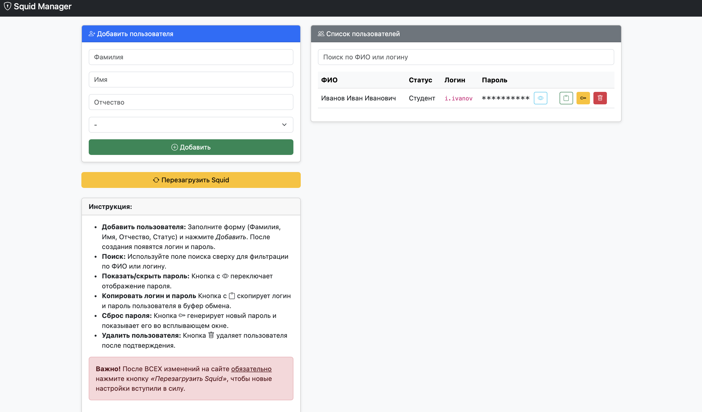

# 🛡️ Squid Manager

**Squid Manager** — веб-интерфейс на **Flask** для управления пользователями прокси-сервера **Squid**.  
Позволяет быстро добавлять/удалять пользователей и обновлять конфигурацию через удобный веб-интерфейс.

---

## 📂 Структура проекта
```

squid-manager/
├── squid/                        # Конфигурация Squid
│   ├── squid.conf                # Основной конфиг
│   ├── whitelist                 # Белый список доменов
│   └── passwd                    # Файл с паролями (в .gitignore)
│
├── squid-admin/                  # Веб-интерфейс админки
│   ├── app.py                    # Бэкенд на Flask
│   ├── requirements.txt          # Зависимости Python
│   ├── static/                   # Фронтенд
│   │   ├── index.html
│   │   └── images/
│   │       └── squid-admin.png
│   └── users.json                # Пользователи (в .gitignore)
│
├── .gitignore
└── README.md

````

---

## ⚡ Установка и запуск

### 1. Установить Squid и зависимости
```bash
sudo apt update
sudo apt install -y squid apache2-utils python3-flask
````

### 2. Скопировать конфиги Squid

```bash
sudo cp -r <репозиторий>/squid/* /etc/squid/
sudo chmod 644 /etc/squid/passwd
```

### 3. Скопировать админку

```bash
sudo mkdir -p /opt/squid-admin
sudo cp -r <репозиторий>/squid-admin/* /opt/squid-admin/
sudo chown -R proxy:proxy /opt/squid-admin
sudo chmod -R 750 /opt/squid-admin
```

### 4. Настройка прав пользователя

Чтобы пользователь `proxy` мог управлять Squid через админку, ему нужно добавить права на выполнение команд от имени root без запроса пароля:

```bash
sudo visudo
```

Добавьте строки:

```
proxy ALL=(ALL) NOPASSWD: /usr/bin/truncate -s 0 /etc/squid/passwd
proxy ALL=(root) NOPASSWD: /usr/bin/htpasswd -b /etc/squid/passwd *
proxy ALL=(root) NOPASSWD: /bin/systemctl reload squid
```

### 5. Настроить firewall

```bash
sudo ufw allow 3128/tcp
sudo ufw allow 5000/tcp
```

### 6. Запустить вручную (тестовый запуск)

```bash
cd /opt/squid-admin
python3 app.py
```

Приложение будет доступно 👉 `http://localhost:5000`

---

## ⚙️ Автозапуск через systemd

### 7. Создание systemd-сервиса

```bash
sudo nano /etc/systemd/system/squid-admin.service
```

Пример конфигурации:

```ini
[Unit]
Description=Squid Admin Panel
After=network.target

[Service]
Type=simple
User=proxy
Group=proxy
WorkingDirectory=/opt/squid-admin
ExecStart=/usr/bin/python3 /opt/squid-admin/app.py
Restart=always
RestartSec=5

[Install]
WantedBy=network.target
```

### 8. Перезапуск и автозапуск сервисов

```bash
sudo systemctl daemon-reload
sudo systemctl enable --now squid squid-admin
```

---

## 🖼️ Скриншот интерфейса


