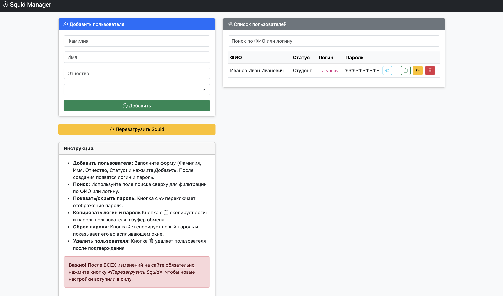

# Squid Manager

A small Flask web interface for managing Squid proxy users. Supports adding, removing,
and resetting proxy credentials; rebuilds the Squid password file atomically and reloads
the service.

## Project Structure

```text
squid-manager/
├── deploy/
│   ├── squid-admin.env.example   # Environment template
│   └── squid-admin.service       # systemd unit
├── squid/
│   ├── squid.conf                # Squid configuration
│   └── whitelist                 # Allowed domains
├── squid-admin/
│   ├── app.py                    # Flask backend
│   ├── requirements.txt          # Python dependencies
│   ├── test_app.py               # Unit tests
│   └── static/
│       └── index.html            # Web UI
├── Makefile
├── .gitignore
└── README.md
```

Runtime files `squid/passwd` and `squid-admin/users.json` are created on first use
and are excluded from version control.

## Requirements

- Linux with Squid installed
- Python 3.8+
- `apache2-utils` (provides `htpasswd`)
- `systemd`

## Local Development

Install Flask:

```bash
pip install -r squid-admin/requirements.txt
```

Run tests:

```bash
make test
```

Run tests and check for whitespace issues:

```bash
make check
```

Start the development server:

```bash
make run
```

The server starts at `http://localhost:5000` with credentials `admin` / `dev`.
The Squid reload endpoint is not functional in this mode; it requires a configured
production host with the sudoers rules in place.

## Production Deployment

### 1. Install packages

```bash
sudo apt update
sudo apt install -y squid apache2-utils python3-flask
```

### 2. Install Squid configuration

```bash
sudo cp <repository>/squid/squid.conf /etc/squid/squid.conf
sudo cp <repository>/squid/whitelist /etc/squid/whitelist
```

Create an empty password file with correct ownership:

```bash
sudo install -o root -g proxy -m 640 /dev/null /etc/squid/passwd
```

### 3. Install the admin application

```bash
sudo mkdir -p /opt/squid-admin
sudo cp -r <repository>/squid-admin/* /opt/squid-admin/
sudo chown -R proxy:proxy /opt/squid-admin
sudo chmod -R 750 /opt/squid-admin
```

### 4. Configure sudo permissions

The `proxy` user needs permission to update the Squid password file and reload Squid
without a password prompt.

```bash
sudo visudo
```

Add:

```text
proxy ALL=(root) NOPASSWD: /usr/bin/htpasswd -c -i /etc/squid/passwd.new *
proxy ALL=(root) NOPASSWD: /usr/bin/htpasswd -i /etc/squid/passwd.new *
proxy ALL=(root) NOPASSWD: /bin/mv /etc/squid/passwd.new /etc/squid/passwd
proxy ALL=(root) NOPASSWD: /usr/bin/rm -f /etc/squid/passwd.new
proxy ALL=(root) NOPASSWD: /usr/bin/truncate -s 0 /etc/squid/passwd
proxy ALL=(root) NOPASSWD: /bin/systemctl reload squid
```

The reload endpoint writes credentials to `/etc/squid/passwd.new` via `htpasswd -i`
(password read from stdin, never passed as a command argument), then atomically replaces
`/etc/squid/passwd` with `mv`. If generation fails partway, `passwd.new` is removed and
the live `passwd` file is left untouched. The `truncate` rule is used only when the user
list is empty.

### 5. Configure environment variables

```bash
sudo cp <repository>/deploy/squid-admin.env.example /etc/squid-admin.env
sudo nano /etc/squid-admin.env
```

Set a strong admin password and verify all paths:

```ini
SQUID_ADMIN_LOGIN=admin
SQUID_ADMIN_PASSWORD=change-this-password
SQUID_ADMIN_HOST=127.0.0.1
SQUID_ADMIN_PORT=5000
SQUID_ADMIN_USERS_FILE=/opt/squid-admin/users.json
SQUID_PASSWD=/etc/squid/passwd
```

Restrict access to the file:

```bash
sudo chown root:proxy /etc/squid-admin.env
sudo chmod 640 /etc/squid-admin.env
```

By default the admin interface binds to `127.0.0.1`. For remote access, use an SSH tunnel,
VPN, or a reverse proxy with TLS and access control. Do not expose port 5000 directly to
the public internet.

### 6. Configure firewall

```bash
sudo ufw allow 3128/tcp
```

### 7. Enable systemd service

```bash
sudo cp <repository>/deploy/squid-admin.service /etc/systemd/system/squid-admin.service
sudo systemctl daemon-reload
sudo systemctl enable --now squid squid-admin
```

The unit file:

```ini
[Unit]
Description=Squid Admin Panel
After=network.target

[Service]
Type=simple
User=proxy
Group=proxy
WorkingDirectory=/opt/squid-admin
EnvironmentFile=/etc/squid-admin.env
ExecStart=/usr/bin/python3 /opt/squid-admin/app.py
Restart=always
RestartSec=5

[Install]
WantedBy=network.target
```

## Security Notes

- Set a strong value for `SQUID_ADMIN_PASSWORD` before deployment. The placeholder
  `change-this-password` must not be used in production.
- Keep `/etc/squid-admin.env` readable only by root and the proxy group (`chmod 640`).
- `users.json` stores proxy credentials in plaintext. Restrict access: `chmod 600`.
- Do not expose the Flask development server to the public internet. Use a reverse proxy
  with TLS for any external access.
- After making changes in the web interface, use the "Reload Squid" button to apply them
  to `/etc/squid/passwd`.

## Screenshot


